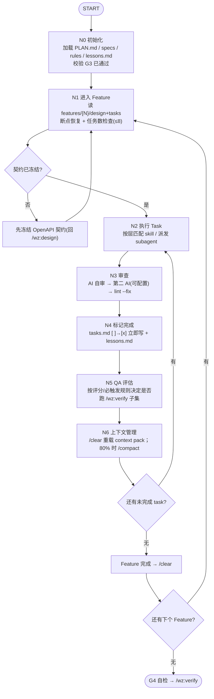

# /wz:ai — 多 Agent 实现（节点执行循环）

第 4 阶段。Orchestrator 按 **N0–N7 节点状态机** 逐 task 推进。不越过任务边界、不直接部署生产。

## 编排

## 全局规则（强制）
- **按节点顺序执行，严禁跳过**；每个节点结束输出确认行：`✓ [节点] 完成，进入 [下一节点]`。
- **暂停**：业务逻辑歧义、不确定的安全问题、破坏性变更（删列/改类型/权限/计费）、环境阻塞。
- **不暂停**：纯技术选型——选最优解直接执行。
- 串/并行由依赖决定：无依赖且分属不同项目/文件 → 并行派发 subagent；有依赖/改同一文件/共享 schema → 串行 inline 调 skill。

---

## N0 初始化
1. 从 `$ARGUMENTS` 解析 specs 路径与代码项目路径；校验 `.wz/state/gate.json` 的 **G3=passed**，否则停止并提示先跑 `/wz:plan`。
2. 加载：`docs/specs/PLAN.md`（feature 顺序与依赖）、全局 `product.md/architecture.md/acceptance.md`、`.wz/rules/*`、`.wz/memory/lessons.md`、`.wz/config.json`。
3. 按 PLAN.md 推荐顺序排好 feature 队列。

## N1 进入 Feature
1. 读 `docs/specs/features/{N}.{name}/design.md` 与 `tasks.md`。
2. **断点恢复**：`[x]` 跳过，`[DROPPED]` 跳过，`[CHANGED]` 按更新描述执行，`[NEW]` 正常执行。全部完成 → 进入下一 feature。
3. **任务数检查**：统计未完成 `[ ]`，>8 个则按 `/wz:plan` 规则回退重切（不得硬塞）。
4. **契约门**：涉及前后端集成的 feature，契约未冻结前不并行写最终集成代码——先回 `/wz:design` 冻结 `docs/contracts/openapi.yaml`。
5. 输出执行计划（串行/并行分组）。

## N2 执行 Task
开始标记：`🔨 {feature序号}.T-xxx: {描述} ~{估时} | Feature {F}/{总} | 任务 {n}/{总}`

按层匹配执行单元：

| 层 | 串行（inline skill） | 并行（派发 subagent，subagent_type） |
|---|---|---|
| 前端 | `react-tailwind-ui` | `frontend-builder` |
| 后端 | `lambda-service` | `backend-builder` |
| 基础设施 | `aws-cdk-iac` | `infra-builder` |
| 测试 | `testing` | `test-agent`（一般在 N5 派发） |
| 无匹配 | AI 直接执行 | — |

派发 subagent 时 prompt **必须传齐**冷启动 context pack：specs 路径、本 task 编号与描述、相关 design 模块、文件范围、代码项目路径、验证命令。subagent 内部自行加载同名 skill + 该 feature specs + rules + lessons.md，最终回报「文件清单 + 验证结果 + 待配合事项 + 阻塞点」。

**前端还原硬要求**（用户原始约束）：依 HTML+CSS 设计稿用 React+Tailwind 还原——① 保证组件结构与层次、还原布局样式；② 用 Tailwind 实用类保证一致性可维护；③ 细节与交互对齐设计稿；④ 动态交互/动画用 React 状态与生命周期实现。

## N3 审查（双 AI，每个 task 粒度）
1. **AI 自审**：本 task diff 的代码质量/逻辑/边界/错误处理/安全（硬编码密钥、注入、OWASP）/性能。
2. **第二 AI 独立审查**（后端 `.wz/config.json` → `reviewer.backend`，可选 `claude-subagent`(默认) / `codex` / `gpt`）：传**本 task 变更 diff**，要求审查质量/逻辑/安全；合理建议→修复后复审，误报→记录理由忽略。详见 `/wz:review` 与 reviewer agent。
3. **Lint**：跑项目 lint，`--fix` 可自动修；类型检查通过。
4. 审查通过方可进入 N4；不通过则定向修复（同一 task 内，最多两轮，超出升级人工）。

## N4 标记完成（强制，不可跳过）
1. 用 Edit 把该 task 行 `- [ ]` 改为 `- [x]`（仅改 checkbox），改完重读确认已写入。
2. **lessons.md**：有架构决策/踩坑/跨 feature 影响/环境特殊处理 → 追加 `.wz/memory/lessons.md`（格式 `## {日期} — {feature}/{task}`）；常规开发不记。
3. 输出进度行。

## N5 QA 评估
按 `/wz:verify` 的触发评分（变更范围/风险/累积/边界，总分≥8）或必触发条件（feature 全完成 / API 变更 / 数据库 migration / 认证授权计费 / 连续 5 task 未 QA）决定是否派 `test-agent` 跑验证子集。通过→继续；发现 bug→对应工种修复后重测，最多 3 轮。

## N6 上下文管理（落地第 13 节）
- **task 完成后**：`/clear`，重新加载当前 feature 的 specs + `lessons.md` + rules（即重建 task context pack），再做下一个 task。
- **task 执行中**上下文达 ~80%：`/compact` 后继续。
- **feature 完成后**：`/clear` 进入下一 feature。
- 全程自动继续，无需等待用户指令（暂停条件除外）。

## 输出与 Gate
- 产物：前后端/IaC 代码、单测、`docs/evidence/changelog-<task>.md`、更新后的 tasks.md 与 lessons.md。
- `G4`：所有分配 task 实现并自审+第二 AI 审查通过；改动不超声明文件范围。
下一步：`/wz:verify`。
