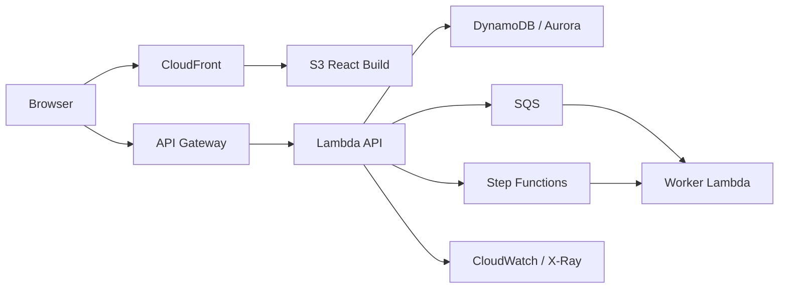

# 架构规格（architecture.md）

> 只记录**已选方案 + 备选 + 理由 + 成本 + 风险**，不写无结论的技术百科。

## 系统架构图

## 部署边界
| 层 | AWS 服务 | 职责 |
|---|---|---|
| 前端 | S3 + CloudFront | 静态资源、缓存、HTTPS |
| API | API Gateway + Lambda | HTTP 接口、认证、用例 |
| 数据 | DynamoDB / Aurora Serverless | 按访问模式选择 |
| 异步 | SQS + Lambda | 重试、削峰、解耦 |
| 长流程 | Step Functions | 多步骤、补偿、可视化 |
| 观测 | CloudWatch + X-Ray | 日志、指标、Trace |
| 配置 | SSM / Secrets Manager | 参数与密钥 |

## 数据模型 / 访问模式
## 关键决策（链接 docs/decisions/ADR-xxx）
## 风险与缓解
