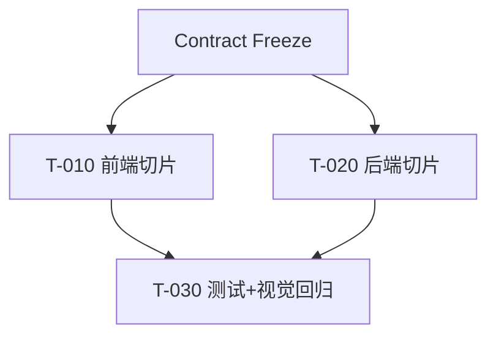

# {Feature 名称} — 任务清单

> task = 需求 × 层 的最小可验证切片；单 task 估时 ≤30min（仅 5/15/30）；单 feature 4–8 任务。
> ID 在本 feature 内编号，跨 feature 引用加 `{序号}.` 前缀（如 `2.T-004`）。

## 任务版本
| 日期 | 版本 | 说明 |
|---|---|---|
| 2026-01-01 | v1 | 初始任务 |

## 依赖图

## 任务列表（断点标记：[ ]/[x]/[CHANGED]/[DROPPED]/[NEW]）
### 功能 1：{功能名}
- [ ] T-001: {需求×层切片，可独立验证} ~30min  · 需求 FR-001 · 范围 services/api/src/** · 验证 `npm test -w api` · 证据 -
- [ ] T-002: {切片} ~15min  · 需求 UX-001 · 范围 apps/web/src/components/** · 验证 `npm test -w web` · 证据 docs/evidence/visual

### 集成与测试
- [ ] T-030: 联调 + 视觉回归 ~30min · 需求 UX-001 · 验证 `npm run test:visual` · 证据 docs/evidence/visual

## 依赖关系
- T-002 依赖 T-001；跨 feature 写全限定 ID（本 feature 序号为 3 时 `3.T-001 依赖 2.T-004`）。

## 风险点
- {可能问题及应对}

> ⛔ 反例：`T-001 实现登录功能 ~30min`。✅ 正例：拆成接口/表单/持久化三切片。
