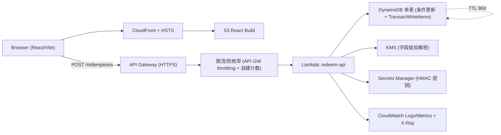

# 架构规格（architecture.md）— 卡密兑换平台 MVP

> 依据 ADR-0001（DynamoDB / KMS+Secrets Manager / 单管理员 / 90天TTL / MVP-1 仅前台+兑换API）。

## 系统架构图

## 部署边界
| 层 | AWS 服务 | 职责 |
|---|---|---|
| 前端 | S3 + CloudFront | React 静态资源、缓存、HTTPS/HSTS（SEC-003） |
| API | API Gateway + Lambda(Node 22) | 兑换/查询/售后接口、限流、输入校验 |
| 数据 | DynamoDB（按访问模式单表） | 卡密/商品/库存/兑换/审计；TTL 90 天（D2） |
| 密钥 | KMS + Secrets Manager | 字段级加密 + HMAC 索引密钥，与数据分离（D4/SEC-001/006） |
| 观测 | CloudWatch + X-Ray | JSON 日志、错误码分布、P95、暴力尝试、异常并发（NFR-005） |
| IaC | AWS CDK | 全部资源仅经 CDK，禁止控制台漂移 |

> MVP-1 不含 SQS/Step Functions：兑换为短同步流程（P95 ≤ 2s，NFR-001），无长耗时 AI 任务，故不引入异步层。如未来加自动发卡/批量再评估。

## 数据模型 / 访问模式（DynamoDB 单表设计）
单表 `redemption`，主键 `PK` / `SK`，配合 GSI 支持售后查询。

| 实体 | PK | SK | 关键属性 | 访问模式 |
|---|---|---|---|---|
| Product | `PRODUCT#<sku>` | `META` | name, delivery_type, status, instructions | 按 SKU 取商品 |
| CardKey | `CARD#<code_hmac>` | `META` | batch_id, product_sku, status, order_ref, expires_at(epoch), redeemed_at | 按 HMAC 索引查卡密（SEC-001） |
| InventoryItem | `PRODUCT#<sku>` | `INV#<inv_id>` | status(AVAILABLE/LOCKED/DELIVERED), encrypted_payload(KMS), assigned_redemption_id | 按 SKU 取可用库存 |
| Redemption | `RDM#<redemption_id>` | `META` | request_id, card_hmac, product_sku, inventory_id, result, ip_hash, created_at, ttl(epoch) | 按兑换编号查（FR-005/207） |
| AuditLog | `RDM#<redemption_id>` | `LOG#<ts>` | actor_type, action, detail(脱敏), created_at, ttl | 按兑换编号取日志 |
| Idempotency | `IDEMP#<request_id>` | `META` | redemption_id, productView, deliveryType, **deliveryCipher(KMS密文)**, redeemedAt, ttl | request_id 幂等（FR-302）。**只存密文不存交付明文（SEC-006，F-101）**，重放/GET 时 reconstructSuccess() 解密 |

**GSI1（售后/运营查询 FR-203/207）**：`GSI1PK = ORDER#<order_ref>` 或 `CARD4#<末四位>`，`GSI1SK = created_at`。

### 兑换原子性（核心，SEC-002 / FR-106）
单次 `TransactWriteItems`：
1. `Update CARD#<hmac>`：`SET status=REDEEMED` **ConditionExpression** `status = AVAILABLE`（条件更新，乐观锁）。
2. `Update PRODUCT#<sku> / INV#<inv_id>`：`SET status=LOCKED, assigned_redemption_id=:rid` 条件 `status = AVAILABLE`。
3. `Put RDM#<rid>`：兑换记录，条件 `attribute_not_exists(PK)`。
4. `Put IDEMP#<request_id>`：条件 `attribute_not_exists(PK)`（重复 request_id → TransactionCanceled → 读回原结果返回，FR-302/107）。
任一条件失败 → 整个事务取消，卡密与库存保持原状可恢复（NFR-003）。

## 后端分层（L1 lambda 规则）
- `handler/`：协议适配，解析事件、输入白名单校验、组装响应、统一错误码。
- `domain/`：兑换用例、状态机、幂等编排——纯函数，不依赖 AWS SDK，单测覆盖 ≥80%。
- `repository/`：DynamoDB 访问，封装 TransactWriteItems / 条件更新，便于替换与 mock。
- `crypto/`：KMS 加解密 + HMAC 索引计算（密钥从 Secrets Manager 取，模块级缓存）。

## 安全与限流
- API Gateway 节流 + 自建 IP/网段计数（DynamoDB 计数或内存窗口）实现 SEC-005 递增等待与 TOO_MANY_ATTEMPTS。
- 错误响应统一映射到 7 类业务错误码，绝不透传 DDB 错误/库存 ID/明文（SEC-004）。
- CSP、SameSite、CSRF 策略由 CloudFront/前端配置（SEC-008，细化在 6.security-hardening）。

## 关键决策（链接 docs/decisions/ADR-xxx）
- ADR-0001 — MVP 架构决策（DB/密钥/认证/保留期/范围）。
- ADR-0002 — OpenAPI 契约冻结（见 docs/decisions/0002-*）。

## 风险与缓解
| 风险 | 缓解 |
|---|---|
| DynamoDB 无原生多行事务认知偏差 | 用 TransactWriteItems（最多 100 项，单次满足）+ 条件表达式 |
| 暴力枚举卡密 | HMAC 不可逆 + 限流递增等待 + 异常验证码（SEC-005） |
| 密钥泄露 | KMS 信封加密 + Secrets Manager 轮换 + IAM 最小权限（SEC-001/006） |
| 库存与卡密状态不一致 | 全在单次事务内变更，失败整体回滚（NFR-003） |
| 无 git 版本控制 | ASSUMPTION 已记；建议 review/deploy 前补 git init |
