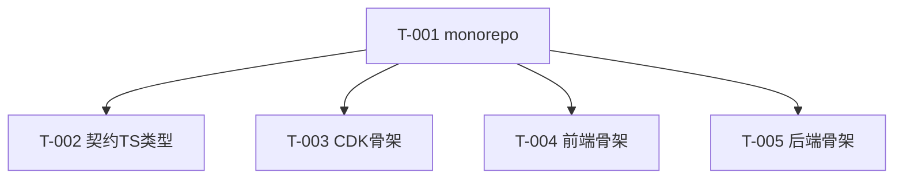

# 0.scaffold — 任务清单

> 项目骨架，所有 feature 的前置。design 见 architecture.md。

## 任务版本
| 日期 | 版本 | 说明 |
|---|---|---|
| 2026-06-19 | v1 | 初始任务 |

## 依赖图

## 任务列表（断点标记：[ ]/[x]/[CHANGED]/[DROPPED]/[NEW]）
### 功能：工程骨架
- [x] T-001: 初始化 npm workspaces monorepo（apps/web、services/api、infrastructure、packages/contracts）~30min · 需求 NFR-006 · 范围 `package.json`,`*/package.json` · 验证 `npm install` 成功 · 证据 docs/evidence/changelog-0.scaffold.md
- [x] T-002: 从 `docs/contracts/openapi.yaml` 生成 TS 类型到 packages/contracts ~15min · 需求 NFR-006（契约一致） · 范围 `packages/contracts/**` · 验证 node strip-types 跑通 ERROR_CATALOG/类型 · 证据 docs/evidence/changelog-0.scaffold.md
- [x] T-003: CDK 应用骨架（空 stack `Wz-preview`，env 参数化）~30min · 需求 NFR-006 · 范围 `infrastructure/**` · 验证 `npx cdk synth Wz-preview -c env=preview`（本地环境） · 证据 docs/evidence/changelog-0.scaffold.md
- [x] T-004: 前端 Vite+React+TS+Tailwind 骨架，预置 `VITE_API_BASE_URL` 环境变量 ~30min · 需求 UX-003 · 范围 `apps/web/**` · 验证 `npm run build -w web`（本地环境） · 证据 docs/evidence/changelog-0.scaffold.md
- [x] T-005: 后端 Lambda handler/domain/repository 目录骨架 + Vitest 配置 ~15min · 需求 NFR-006 · 范围 `services/api/**` · 验证 `npm test -w api`（本地环境） · 证据 docs/evidence/changelog-0.scaffold.md

## 依赖关系
- T-002/003/004/005 均依赖 T-001。

## 风险点
- 无 git（ASSUMPTION）：建议本 feature 后补 `git init` 以便后续 diff 审查。
