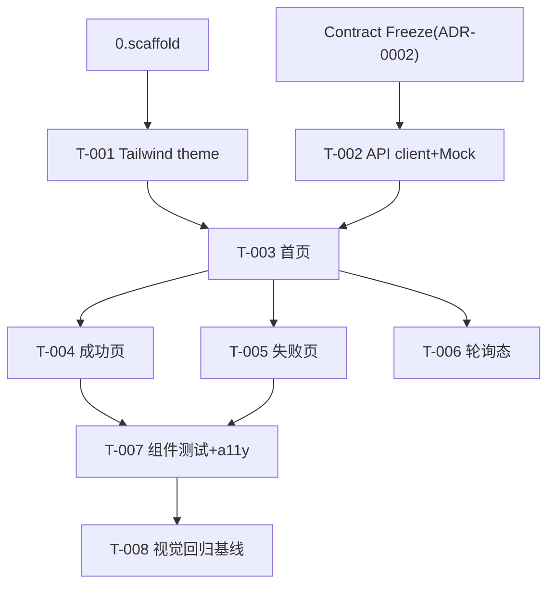

# 1.redeem-frontend — 任务清单

> 前台三页还原。design 见本目录 design.md + 原型 design/。契约冻结后用 Mock Server，与 2.redeem-api 并行。

## 任务版本
| 日期 | 版本 | 说明 |
|---|---|---|
| 2026-06-19 | v1 | 初始任务 |

## 依赖图

## 任务列表
### 功能：前台兑换 UI
- [x] T-001: 从 `design/tokens.css` 提取 design tokens 映射 Tailwind theme（禁 magic values）~15min · 需求 UX-003 · 范围 `apps/web/tailwind.config.ts` · 验证 `npm run build -w web`（本地） · 证据 docs/evidence/changelog-1.redeem-frontend.md
- [x] T-002: API client + TS 类型（用 packages/contracts）+ Mock Server（按 openapi）~30min · 需求 FR-004 · 范围 `apps/web/src/api/**` · 验证 node strip-types normalize/validate PASS；mock 调用本地 · 证据 docs/evidence/changelog-1.redeem-frontend.md
- [x] T-003: 兑换首页还原（输入/粘贴规范化、前端校验、按钮 default/loading/disabled 状态机）~30min · 需求 FR-001/002/003 · 范围 `apps/web/src/pages/RedeemHome.tsx`,`components/**` · 验证 组件测试（本地）+ node 校验逻辑 · 证据 docs/evidence/changelog-1.redeem-frontend.md
- [x] T-004: 成功页还原（商品/有效期/按 delivery_type 渲染交付/一键复制/兑换编号）~30min · 需求 FR-005/006/007 · 范围 `apps/web/src/pages/RedeemResult.tsx` · 验证 `npm test -w web`（本地） · 证据 docs/evidence/changelog-1.redeem-frontend.md
- [x] T-005: 失败页还原（7 类错误码稳定文案 + 售后入口常驻，复用卡片骨架）~30min · 需求 FR-008/009 · 范围 `apps/web/src/pages/RedeemResult.tsx` · 验证 错误文案源自共享 ERROR_CATALOG；本地组件测试 · 证据 docs/evidence/changelog-1.redeem-frontend.md
- [x] T-006: 处理中轮询态（202 → 轮询 GET，禁重复提交）~15min · 需求 FR-010 · 范围 `apps/web/src/pages/RedeemHome.tsx`,`api/client.ts` · 验证 client.poll + loading 锁；本地 · 证据 docs/evidence/changelog-1.redeem-frontend.md
- [x] T-007: 组件单测（正常/空/错误/禁用态）+ a11y（label/键盘/对比度）~30min · 需求 UX-002 · 范围 `apps/web/src/**/*.test.tsx` · 验证 RedeemHome.test.tsx（本地）；label/Enter 键支持 · 证据 docs/evidence/changelog-1.redeem-frontend.md
- [x] T-008: 视觉回归基线（BackstopJS 三页 × 390/1440 × 关键态，原型为 reference）~30min · 需求 UX-001 · 范围 `apps/web/tests/visual/backstop.json` · 验证 backstop reference/test（本地，5 场景×2 视口） · 证据 docs/evidence/visual/

## 依赖关系
- T-001 依赖 0.scaffold；T-002 依赖契约冻结（已）；T-003 依赖 T-001,T-002；T-004/005/006 依赖 T-003；T-007 依赖 T-004,T-005；T-008 依赖 T-007。

## 风险点
- 无外部设计稿：以 design-prototype 原型为像素真值，视觉差阈值用 config.json 的 0.1；高价值差异需人工确认。
- Mock 与真实 API 偏差：契约冻结降低风险；联调阶段（/wz:verify）以真实 API 复测。
