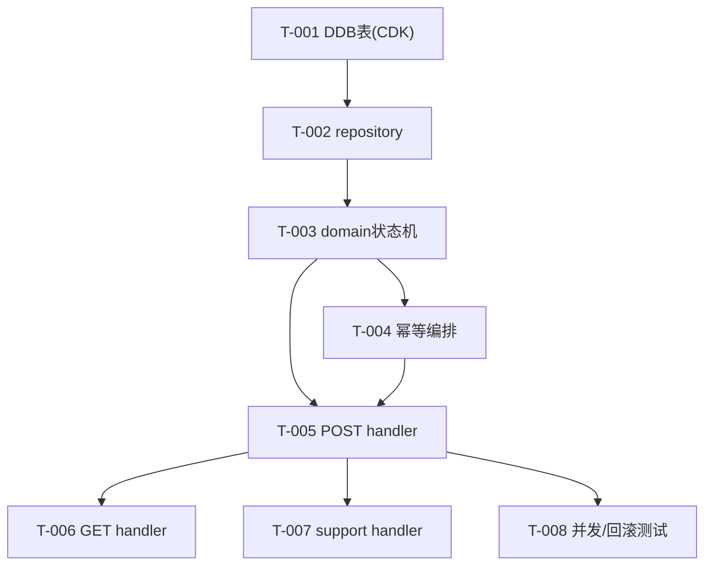

# 2.redeem-api — 任务清单

> 兑换核心后端。design 见本目录 design.md + architecture.md。依赖 0.scaffold、3.data-security。

## 任务版本
| 日期 | 版本 | 说明 |
|---|---|---|
| 2026-06-19 | v1 | 初始任务 |

## 依赖图

## 任务列表
### 功能：兑换 API
- [x] T-001: DynamoDB 单表 CDK 定义（PK/SK + GSI1 售后查询 + TTL 属性）~30min · 需求 FR-106 · 范围 `infrastructure/**` · 验证 `npx cdk synth`（本地，含表+GSI1+TTL+PITR） · 证据 docs/evidence/changelog-2.redeem-api.md
- [x] T-002: repository 访问方法（查卡密 by HMAC、取可用库存、TransactWriteItems 封装、读幂等键）~30min · 需求 FR-106/302 · 范围 `services/api/src/repository/**` · 验证 node strip-types（MemRepo 模拟原子条件写，并发断言全过） · 证据 docs/evidence/changelog-2.redeem-api.md
- [x] T-003: domain 兑换用例 + 6 态状态机校验（有效期/绑定/库存）+ 单测 ~30min · 需求 FR-102/103/104/105 · 范围 `services/api/src/domain/**` · 验证 node strip-types 6 态映射稳定错误码 PASS · 证据 docs/evidence/changelog-2.redeem-api.md
- [x] T-004: domain 幂等编排（重复 request_id 返回原结果，成功后重复查询只返回已兑换）+ 单测 ~15min · 需求 FR-302/107 · 范围 `services/api/src/domain/**` · 验证 node strip-types FR-302/107 PASS · 证据 docs/evidence/changelog-2.redeem-api.md
- [x] T-005: handler POST /redemptions（输入白名单校验、错误码映射、HTTPS-only）~30min · 需求 FR-004/008/SEC-004 · 范围 `services/api/src/handlers/redeem.ts` · 验证 校验逻辑 node strip-types PASS；handler fixture 本地 · 证据 docs/evidence/changelog-2.redeem-api.md
- [x] T-006: handler GET /redemptions/{id}（处理中轮询/终态）~15min · 需求 FR-010 · 范围 `services/api/src/handlers/get-redemption.ts` · 验证 fixture 测试（本地） · 证据 docs/evidence/changelog-2.redeem-api.md
- [x] T-007: handler POST /support/lookup（末四位/订单号/编号 → 脱敏返回）~30min · 需求 FR-207 · 范围 `services/api/src/handlers/support.ts` · 验证 校验+脱敏 node strip-types PASS；fixture 本地 · 证据 docs/evidence/changelog-2.redeem-api.md
- [x] T-008: 集成测试：同卡密并发 20 次只成功一次 + 事务回滚后可恢复 ~30min · 需求 SEC-002/NFR-003 · 范围 `services/api/test/**` · 验证 node strip-types：20并发→1成功/1库存锁定/其余 ALREADY_REDEEMED PASS · 证据 docs/evidence/changelog-2.redeem-api.md

## 依赖关系
- T-001→T-002→T-003→T-004；T-005 依赖 T-003,T-004；T-006/007/008 依赖 T-005。
- 跨 feature：T-002 依赖 `3.T-001`(HMAC)；T-005 依赖 `3.T-002`(KMS 解密交付)。

## 风险点
- DynamoDB TransactWriteItems 100 项上限：单次兑换涉及 4 项，远低于上限，安全。
- 幂等键并发竞争：用条件 `attribute_not_exists` + 事务取消后读回，避免双写。
