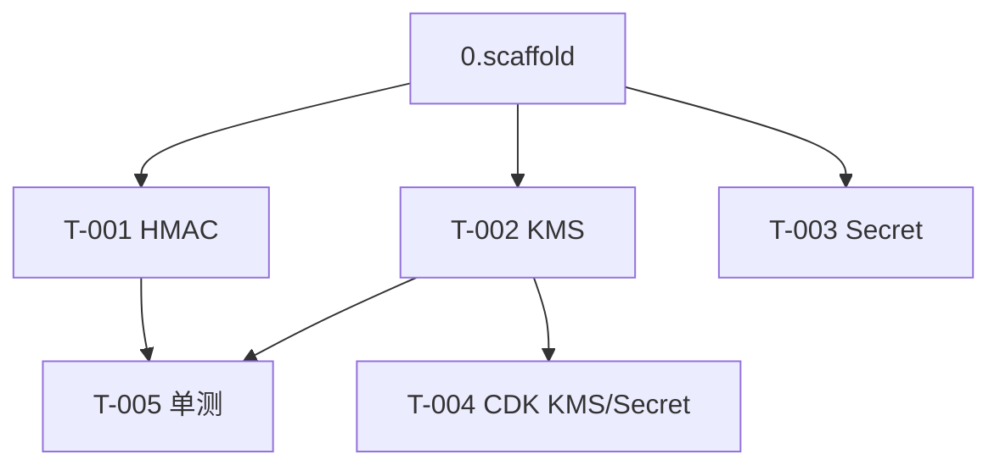

# 3.data-security — 任务清单

> 卡密 HMAC 索引 + 字段级加密 + 密钥托管。design 见 architecture.md「后端分层/安全」。
> ID 跨 feature 引用加 `{序号}.` 前缀。

## 任务版本
| 日期 | 版本 | 说明 |
|---|---|---|
| 2026-06-19 | v1 | 初始任务 |

## 依赖图

## 任务列表
### 功能：数据安全原语
- [x] T-001: HMAC-SHA256 卡密索引计算（domain 纯函数，规范化大小写/去分隔符）+ 单测 ~30min · 需求 SEC-001 · 范围 `services/api/src/crypto/hmac.ts`,`*.test.ts` · 验证 node strip-types 8 断言全过 · 证据 docs/evidence/changelog-3.data-security.md
- [x] T-002: KMS 信封加解密封装（repository 层，client 模块级缓存）~30min · 需求 SEC-006 · 范围 `services/api/src/crypto/kms.ts` · 验证 `npm test -w api`（mock KMS，本地） · 证据 docs/evidence/changelog-3.data-security.md
- [x] T-003: 从 Secrets Manager 取 HMAC 密钥（模块缓存，失败降级报错不静默）~15min · 需求 SEC-001 · 范围 `services/api/src/crypto/secret.ts` · 验证 `npm test -w api`（本地） · 证据 docs/evidence/changelog-3.data-security.md
- [x] T-004: CDK 配置 KMS Key + Secrets Manager secret + Lambda 最小权限 IAM ~30min · 需求 SEC-006/SEC-009 · 范围 `infrastructure/**` · 验证 `npx cdk synth` 含 KMS/Secret（本地）；IAM 在 2.redeem-api grantEncryptDecrypt/grantRead 逐项授予 · 证据 docs/evidence/changelog-3.data-security.md
- [x] T-005: 安全单测：明文不入库断言、HMAC 命中、加解密往返一致 ~15min · 需求 SEC-001 · 范围 `services/api/src/crypto/*.test.ts` · 验证 node strip-types（HMAC 索引不含明文断言通过） · 证据 docs/evidence/changelog-3.data-security.md

## 依赖关系
- 全部依赖 0.scaffold（T-005）。T-005 依赖 T-001/T-002。

## 风险点
- KMS 调用增加延迟：交付内容加解密一次，确认在 P95 ≤ 2s（NFR-001）预算内；如超标考虑缓存解密结果（仅内存、单次请求）。
