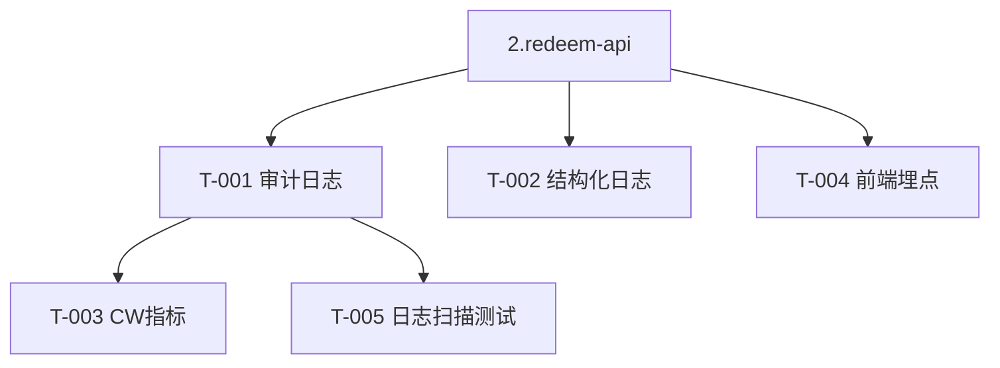

# 4.audit-observability — 任务清单

> 审计日志/结构化日志/指标/埋点。design 见 architecture.md「观测」。依赖 2.redeem-api。

## 任务版本
| 日期 | 版本 | 说明 |
|---|---|---|
| 2026-06-19 | v1 | 初始任务 |

## 依赖图

## 任务列表
### 功能：审计与可观测
- [x] T-001: 审计日志写入（脱敏，仅末四位/不可逆摘要）+ DynamoDB TTL 90 天 ~30min · 需求 FR-301/SEC-007/D2 · 范围 `services/api/src/audit/**`,`infrastructure/**` · 验证 audit.ts 仅写末四位+ipHash+ttl；本地 npm test · 证据 docs/evidence/changelog-4.audit-observability.md
- [x] T-002: 结构化 JSON 日志 + Correlation ID（按兑换编号可检索）~15min · 需求 NFR-006 · 范围 `services/api/src/lib/logger.ts` · 验证 node strip-types redact PASS · 证据 docs/evidence/changelog-4.audit-observability.md
- [x] T-003: CloudWatch 指标（成功率/错误码分布/P95/暴力尝试/异常并发）~30min · 需求 NFR-005 · 范围 `infrastructure/**` · 验证 `npx cdk synth` 含 Dashboard+Alarm（本地） · 证据 docs/evidence/changelog-4.audit-observability.md
- [x] T-004: 前端埋点 5 事件（page_view/code_submit/redeem_result/delivery_copy/support_click）~15min · 需求 FR-303 · 范围 `apps/web/src/analytics/**` · 验证 类型约束排除敏感字段；页面接入；本地 · 证据 docs/evidence/changelog-4.audit-observability.md
- [x] T-005: 日志扫描测试：断言无完整卡密/交付明文 ~15min · 需求 SEC-007 · 范围 `services/api/test/security/log-scan.test.ts` · 验证 node strip-types：完整卡密/交付明文缺席、兑换编号保留 PASS · 证据 docs/evidence/changelog-4.audit-observability.md

## 依赖关系
- 全部依赖 2.redeem-api（兑换流程产生日志/指标点）。T-003 依赖 T-001；T-005 依赖 T-001。

## 风险点
- 日志含敏感字段风险：统一经 logger 脱敏中间件，禁止散点 console.log 交付明文。
