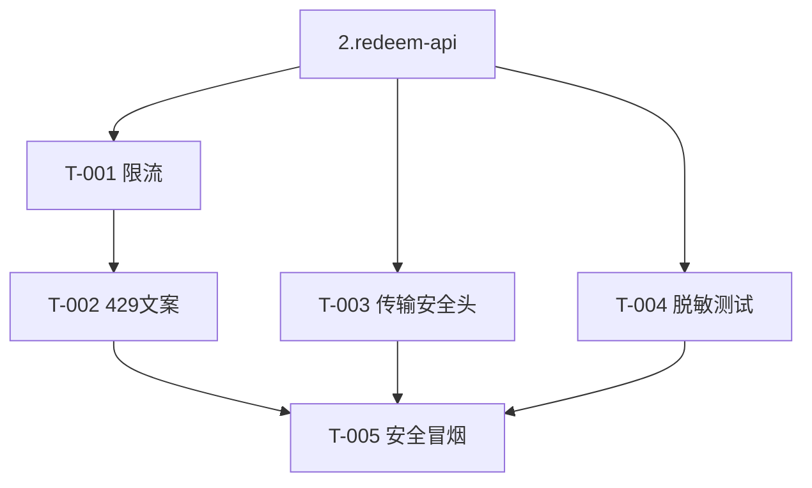

# 6.security-hardening — 任务清单

> 限流/防枚举/传输安全/安全冒烟。design 见 architecture.md「安全与限流」。依赖 2.redeem-api。串行（安全审查不并行）。

## 任务版本
| 日期 | 版本 | 说明 |
|---|---|---|
| 2026-06-19 | v1 | 初始任务 |

## 依赖图

## 任务列表
### 功能：安全加固
- [x] T-001: API GW throttling + IP/网段计数限流（连续失败递增等待）~30min · 需求 SEC-005 · 范围 `infrastructure/**`,`services/api/src/middleware/**` · 验证 node strip-types decideRate PASS（≤10放行/>10递增等待封顶） · 证据 docs/evidence/changelog-6.security-hardening.md
- [x] T-002: TOO_MANY_ATTEMPTS 接入 + 429 Retry-After 头 ~15min · 需求 SEC-005 · 范围 `services/api/src/middleware/rate-limit.ts`,`lib/http.ts` · 验证 errorResponse 429+Retry-After（node PASS） · 证据 docs/evidence/changelog-6.security-hardening.md
- [x] T-003: CloudFront HTTPS+HSTS + CSP/SameSite/CSRF 响应头 ~30min · 需求 SEC-003/008 · 范围 `infrastructure/**` · 验证 `npx cdk synth` 含 ResponseHeadersPolicy（本地） · 证据 docs/evidence/changelog-6.security-hardening.md
- [x] T-004: 错误响应脱敏断言（不漏内部库存 ID/卡密明文/DB 错误/阈值）~15min · 需求 SEC-004 · 范围 `services/api/test/security/**` · 验证 node strip-types：无内部字段泄露/SYSTEM_ERROR 掩盖 PASS · 证据 docs/evidence/changelog-6.security-hardening.md
- [x] T-005: 安全冒烟（鉴权/限流/输入校验/重放/注入）~30min · 需求 验收§12 第8条 · 范围 `services/api/scripts/security-smoke.mjs` · 验证 部署后对 ApiUrl 运行（本地） · 证据 docs/evidence/changelog-6.security-hardening.md

## 依赖关系
- 全部依赖 2.redeem-api 完成；T-005 依赖 T-001/003/004。

## 风险点
- 限流误伤共享出口 IP：网段+设备指纹组合，阈值可配置，避免一刀切。
